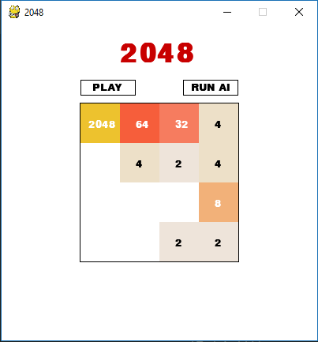
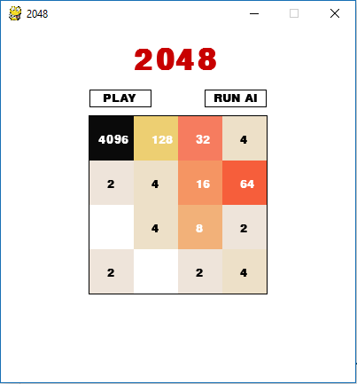

# 2048_AI
The Board games like tic-tac-toe can be easliy defeated with the help of algorithm named MiniMax because it has very small group of possible moves. That is why we can check for evry possible move and choose the move which lead us to winning the game. But the game like 2048 cannot be defeated by this algorithm as next move depends on the new tile which comes randomly at any position. The value(2 or 4) on the tile is dependant on the game designer.

The Expectimax algorithm is very effective in such cases as next state of the game is uncertain. Expectimax search is a search/decision-making algorithm that maximizes the average (expected) reward. It is typically applied to trees that have stochastic nodes, where the outcome of an action is uncertain.

The algorithm works on the evaluation function. The on i used is as follows:
[[2^15,  2^14,  2^13,  2^12] 
[2^8,    2^9,   2^10,  2^11] 
[2^7,    2^6,   2^5,   2^4] 
[2^0,    2^1,   2^2,   2^3]] 

## Expectimax Tree

## AI beating 2048

## Highest score

